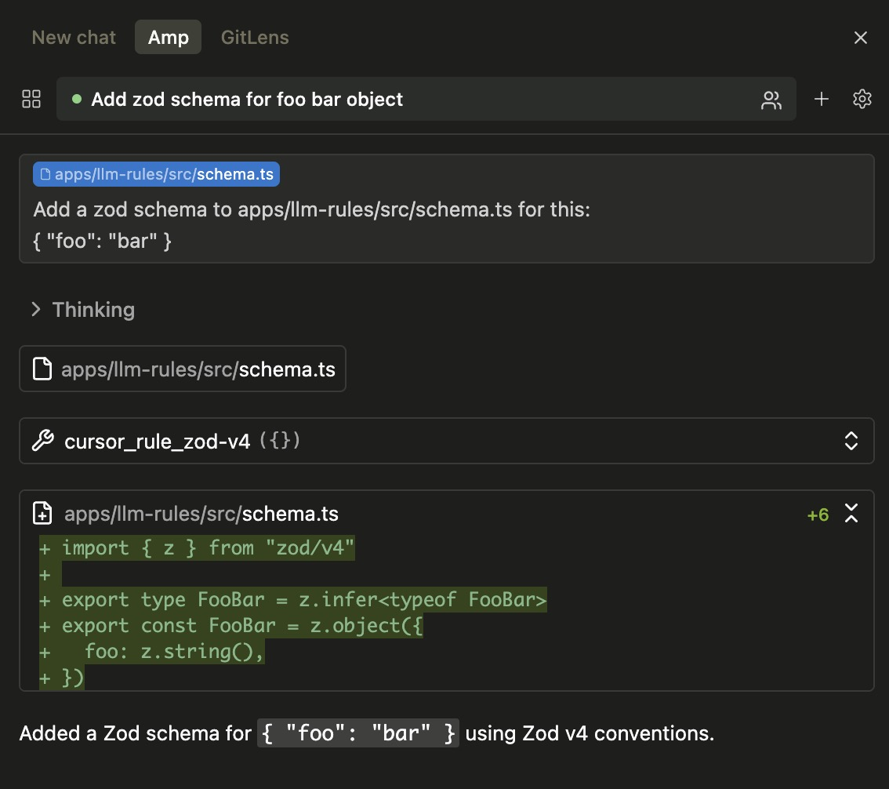
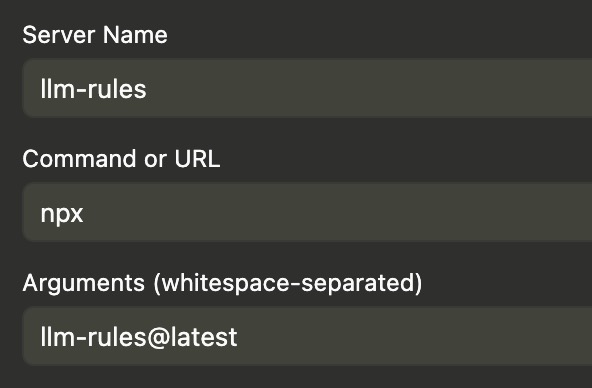

# llm-rules

A Model Context Protocol (MCP) server that provides tools for accessing Cursor rules found in `.cursor/rules/*.mdc` files within a repository. This allows AI tools like Claude and other LLM assistants to access and use Cursor rules through the MCP protocol.

## Overview

This package creates an MCP server that dynamically discovers Cursor rule files and exposes them as callable tools. Each rule file becomes a tool that can be invoked to retrieve the rule content, with descriptions automatically extracted from the frontmatter.

### Why use this?

Instead of loading all Cursor rules into your AI assistant's context at once, this MCP server allows tools like AmpCode and Claude Code to dynamically load only the rules that are relevant to your current task. This approach offers several benefits:

- **More flexible than static files** - Unlike `AGENT.md` or `CLAUDE.md` which are always loaded, Cursor rules include descriptions that tell the LLM exactly when to use them
- **Reduced context size** - Only relevant rules are loaded, leaving more space for your actual code and conversation
- **Better performance** - Smaller context means faster responses and lower token usage
- **Smarter rule selection** - Tool descriptions include file patterns (`globs`) and always-apply status, helping AI assistants choose the right rules automatically
- **Scalability** - Add as many rules as needed without bloating the initial context
- **Real-time updates** - Changes to rule files are immediately available without restarting your AI assistant

## Demo



_Example showing AmpCode automatically using the `cursor_rule_zod-v4` tool when working with Zod, ensuring proper v4 imports are used._

## Usage

Start the MCP server:

```bash
# Using npx
npx llm-rules@latest --dir /path/to/your/repository

# Using bunx
bunx llm-rules@latest --dir /path/to/your/repository

# Or from the current working directory (--dir is optional)
npx llm-rules@latest
```

The `--dir` flag is optional and defaults to the current working directory.

**Note:** When using the AmpCode extension for VSCode/Cursor/Windsurf, the `--dir` flag is not needed as the extension automatically sets the working directory to your project root.

**The server will:**

- Scan the specified directory (or current directory) for `.cursor/rules/*.mdc` files
- Create MCP tools named `cursor_rule_<filename>` for each rule
- Extract descriptions and metadata from frontmatter to help LLMs understand when to use each tool
- Include file patterns (`globs`) and always-apply status in tool descriptions for better context
- Serve the rules through the MCP protocol on stdio

### MCP Configuration

To use with MCP clients:

<details>
<summary><strong>Amp Code</strong></summary>

Add this to your Amp settings:

**VS Code Configuration** (`.vscode/settings.json`):

```json
{
  "amp.mcpServers": {
    "rules": {
      "command": "npx",
      "args": ["llm-rules@latest"]
    }
  }
}
```



</details>

<details>
<summary><strong>Claude Code</strong></summary>

**Project Configuration:**

```sh
claude mcp add --scope project rules -- npx llm-rules@latest
```

</details>

<details>
<summary><strong>Claude Desktop</strong></summary>

Add to your `claude_desktop_config.json`. See [Claude Desktop MCP docs](https://modelcontextprotocol.io/quickstart/user) for more info.

```json
{
  "mcpServers": {
    "rules": {
      "command": "npx",
      "args": ["llm-rules@latest", "--dir", "/path/to/your/repository"]
    }
  }
}
```

</details>

### Example Rule

Here's an example Cursor rule file (`.cursor/rules/zod-v4.mdc`):

```markdown
---
description: Zod v4 Coding Guidelines. ALWAYS read this when using Zod
globs:
alwaysApply: false
---

# Zod v4 Coding Guidelines

## Important: Always Use Zod v4

When working with Zod, **ALWAYS** use Zod v4 by importing from `'zod/v4'`. Never use the default `'zod'` import, which is Zod v3.
```

This creates a tool named `cursor_rule_zod-v4` with the description "Read Cursor rule: Zod v4 Coding Guidelines. ALWAYS read this when using Zod". The LLM can see from the description that this rule should be loaded when working with Zod.

See [the complete example](./src/test/fixtures/valid/.cursor/rules/zod-v4.mdc) for the full rule content.

### Tool Parameters

Each generated tool takes no parameters and returns the rule content without frontmatter. Tool descriptions automatically include metadata from frontmatter (file patterns, always-apply status) to help LLMs choose relevant rules without reading their content first.

## Limitations

- **Single .cursor/rules directory** - Only checks for `.cursor/rules/` at the directory specified by `--dir` (or current working directory). Does not recursively search subdirectories for additional `.cursor/rules/` folders.
- **File changes require restart** - Changes to rule files require restarting the MCP server to be detected.

## Roadmap

Future enhancements planned:

- **Auto-reload after rule changes** - Automatically detect and reload rule files when they change, eliminating the need to restart the server
- **Dynamic project directory tool** - Add an MCP tool to set the project directory dynamically, removing the need for the `--dir` flag
- **Nested cursor rules support** - Load `.cursor/rules/` directories from subdirectories and expose them contextually based on the current working location

## Contributing

See [CONTRIBUTING.md](CONTRIBUTING.md) for development setup and guidelines.
